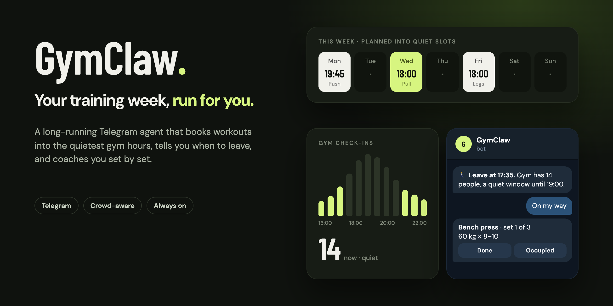
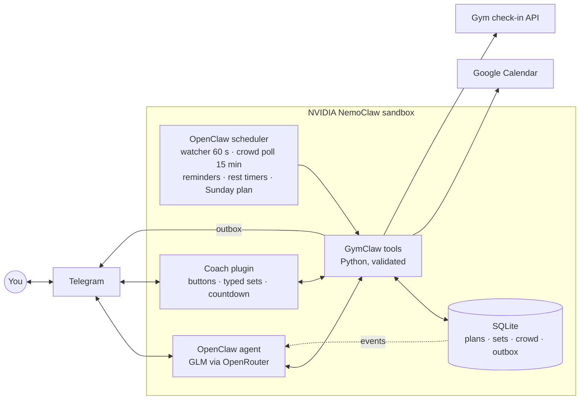
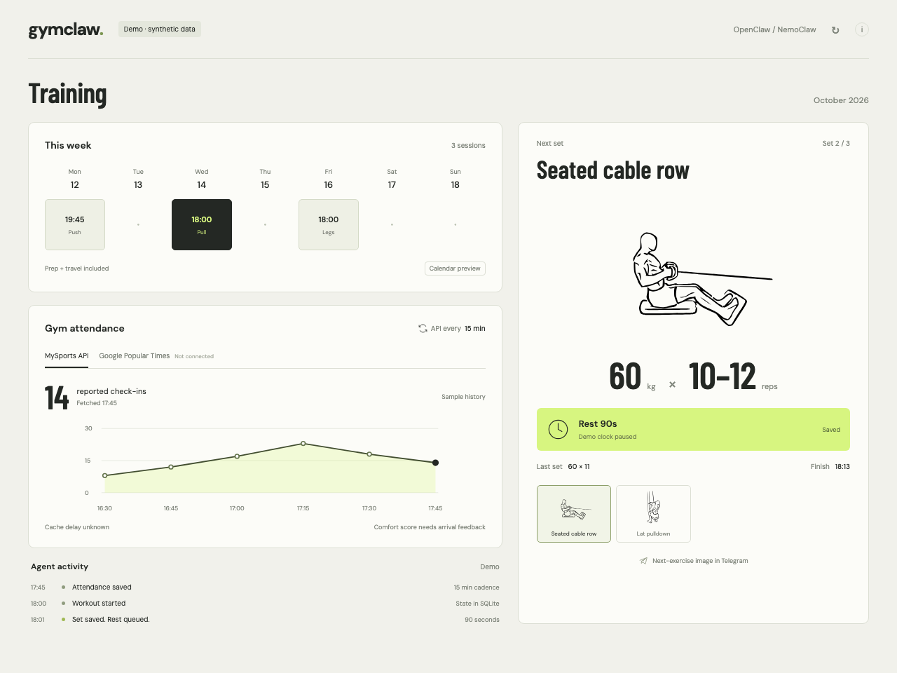

# GymClaw

**A long-running Telegram agent that runs your training week on its own. It books workouts into the quietest gym hours, tells you when to leave, and coaches you set by set.**

[](https://ignoxx.github.io/gymclaw/)

▶ **[Watch the videos](https://ignoxx.github.io/gymclaw/)**: one week with GymClaw (60 s), feature tour (60 s), motion reel (15 s)

<sub>Telegram screens, times and data in the videos are simulated. See [video notes](videos/README.md).</sub>

## Why

Most people can only train after work, which is exactly when the gym is packed. You wait for a bench, skip sets and go home late. Planning around that by hand every week is tedious, and plans break the moment a meeting runs over.

GymClaw takes that job over for good. You set it up once. After that it keeps planning, watching and adjusting week after week, and only messages you when there's something to do.

## A week without asking

GymClaw isn't a chatbot you prompt. It's an agent that stays on and acts on its own schedule.

| When | What GymClaw does, unprompted |
| --- | --- |
| **Every 60 s** | Syncs your calendar and reconciles reminders. Plain code, no model calls. |
| **Every 15 min** in your training hours | Records gym check-in counts to learn when it's quiet. |
| **48 h before a session** | Locks it in and schedules get-ready, leave and start reminders. |
| **Before you go** | Tells you when to leave, with the current crowd. |
| **During the workout** | Fires a rest timer after every logged set and sends the next set. |
| **After the workout** | Saves every set, raises targets you've earned and replans if needed. |
| **Sunday 19:00** | Audits the week, plans the next one into quiet slots and sends a briefing. |
| **Whenever life changes** | Calendar edits, trips and sick days move affected sessions. Pauses expire on their own. |

## What it does

| | |
| --- | --- |
| **Plans** | Reads your calendar (and, read-only, your personal one) and the gym's crowd history, keeps rest days, and picks the quietest slots that fit. |
| **Replans** | Meetings, trips and sick days move sessions to the next valid slot. You can also just say it in chat. |
| **Watches** | Polls gym check-ins and pings you when it's time to leave. |
| **Coaches** | Sends each exercise with an image, target and buttons. Tap `✅ 80 kg × 10` or text `80x10`; it reacts 👍 and shows the next set with a live rest countdown. No model in the loop. |
| **Adapts** | Machine taken? Tap **Swap** for two same-muscle alternatives with images, or wait, or do it later while staying on that muscle group. |
| **Learns** | Hit all your reps and the next target goes up. Your "how busy is it?" answers tune the crowd forecast. |

Setup happens in the same chat: a short interview (goal, experience, days, time, equipment, injuries), then send a photo of your plan or let it build one. Every exercise gets an illustration.

## How it works



The scheduler runs cheap, deterministic work directly. During a workout, the coach plugin handles taps and typed sets without the model. The agent wakes for conversation and for events that need judgment, like a calendar change that breaks a plan. Every action goes through a Python tool that validates it and writes to SQLite, so the agent can't log a set or move a session that doesn't exist.

**Built to keep running:**
- **State lives in SQLite, not in the chat.** Restarts and chat resets don't lose plans, sets or pending reminders. Onboarding resumes where it stopped.
- **Retries are safe.** Every action carries a request ID, so a retry never logs a set twice.
- **No duplicate or lost messages.** Proactive messages go through an outbox with delivery receipts. If a send's outcome is unknown, it asks you instead of resending.
- **Scoped permissions.** It runs inside a NemoClaw sandbox. Calendar writes need separate approval and can be revoked at any time.

## Try it

Python 3.12 or newer. The demo needs no credentials, opens no private data and sends no messages.

```bash
python3 -m venv .venv
source .venv/bin/activate
pip install -e '.[dev]'
python -m gymclaw.dashboard
```

Open http://127.0.0.1:8765. The dashboard runs the real planning and workout code against a throwaway database: the next seven days with expected crowd, today's check-ins against a typical day, and the live workout (or your next session's plan). **Progress** shows consistency, top-set progression, volume by muscle and when the gym is quiet; **History** lists every workout with its sets.



Run the tests with `pytest -q`.

<details>
<summary>Run against your own NemoClaw install</summary>

```bash
python -m gymclaw.dashboard --live
```

Open http://127.0.0.1:8766. This reads saved calendar, crowd, workout and runtime state from your NemoClaw sandbox in read-only mode and starts no new poller. It refreshes every minute; private views stay on localhost.

Agent setup is in [openclaw/README.md](openclaw/README.md). Copy `.env.example` to `.env` and fill in your calendar, gym and Telegram IDs.

</details>

## Status

**Working:** Google Calendar reads, crowd polling via the gym's MySports check-in API, scheduled Telegram delivery with receipts, reading workout plans from photos, resumable onboarding, planning, set logging, progression and replanning.

**In progress:**
- Calendar writes are off while testing.
- A full real-world workout run, including rest reminders and restart recovery, still needs a final check.
- Check-in counts can lag and aren't occupancy percentages.
- VPS deployment and full backup/restore are unfinished.

## Docs

[Agent setup](openclaw/README.md) · [Coach plugin](openclaw/plugins/coach/README.md) · [CLI reference](docs/technical-reference.md) · [Onboarding](docs/onboarding.md) · [Crowd data](docs/crowd.md) · [Inference](docs/inference-runtime.md) · [Spec](SPEC.md) · [Security](SECURITY.md) · [Rebuild the videos](scripts/reel/README.md)

## Credits

Exercise art comes from [Workout Guide](https://github.com/bryllim/workout-guide) by Bryl Lim and Everkinetic, under [CC BY-SA 4.0](https://creativecommons.org/licenses/by-sa/4.0/). GymClaw bundles all 302 first-pose SVGs and 1024 px PNG renders (dark background added). See the [asset notice](gymclaw/assets/workout-guide/NOTICE.md).

GymClaw's own code is under the [MIT License](LICENSE). The exercise art keeps its CC BY-SA 4.0 license.
