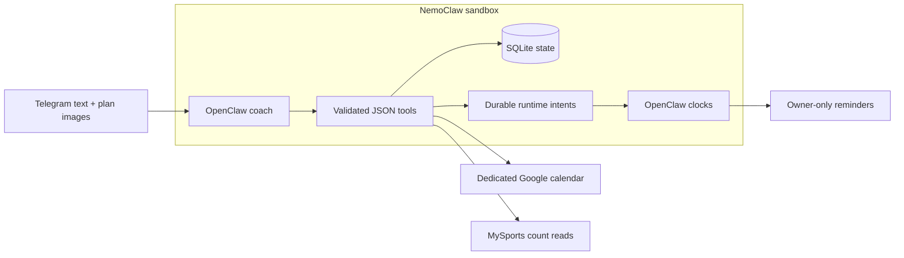

# GymClaw

### Your week, handled.

GymClaw turns a workout plan into a practical week, then guides each set through Telegram. Built with **OpenClaw + NVIDIA NemoClaw**, with deterministic tools and durable state underneath.

**Less scheduling. Less gym-time admin. More training.**


*Read-only visual demo: synthetic calendar, counts and weights generated by real domain services. Not live owner data.*

## The problem

A workout plan is easy to write. Fitting it around meetings, getting through a busy gym, tracking sets and adjusting the next week is the work people keep putting off.

GymClaw handles that loop rather than waiting for a new prompt every time.

## What it does

- **Sets you up without a questionnaire marathon.** Saves your goal, reviews schedule constraints, reads plan images natively, confirms exercises and weights. Resumes where you left off.
- **Plans around life.** Finds valid weekly slots with prep/travel buffers, recovery spacing and session-length constraints. Replans around manual edits, travel and illness.
- **Coaches one set at a time.** Warm-up first, working sets, durable rest intent, updated finish estimate. Busy equipment triggers reordering before substitutions.
- **Learns conservatively.** Stores reported gym counts and arrival feedback. Unknown freshness stays unknown; counts are not occupancy percentages.
- **Keeps control explicit.** Pause/resume, separately revocable calendar writes, owner-only Telegram. Uncertain message delivery is never blindly retried.

## Try the offline demo

Python **3.12+**. No API keys, bot, calendar or gym configuration required.

```bash
python3 -m venv .venv
source .venv/bin/activate
pip install -e '.[dev]'
python -m gymclaw.dashboard
```

Open **http://127.0.0.1:8765**. Switch between the week, workout and crowd views.

The server binds only to localhost, serves an explicit asset allowlist and accepts no writes. Its snapshot runs the real planner and workout state machine in a disposable SQLite DB; it never opens your default DB or activates timers/providers. Screenshots are included for [desktop](assets/dashboard-demo.png) and [mobile](assets/dashboard-mobile-demo.png).

Run the focused domain suite:

```bash
pytest -q
```

## How it works



**Agent thinks. Domain decides.** OpenClaw owns conversations and clocks; Python owns validated planning, workout transitions, idempotency and audit. NemoClaw provides the isolated runtime and scoped egress. The dashboard is a demonstration surface, not a second scheduler or live control panel.

Current local inference uses OpenRouter/GLM. Native image handling and a version-guarded adapter deadline fix are documented in [inference runtime notes](docs/inference-runtime.md); no unrequested OCR or model-switch fallback.

## Verification, without the hype

| Area | Current evidence |
| --- | --- |
| Domain | 154 passing tests: planning, workouts/rest, adaptations, progression, reconciliation, authority, onboarding and demo isolation |
| Telegram | Owner-only tool access and scheduled test delivery verified; groups disabled |
| Calendar | Live dedicated-calendar read sync verified; **publication disabled during testing** |
| Crowd | Live MySports count read/persistence and guarded 15-minute polling activated; backend cache delay unknown |
| Images + onboarding | Native vision passed a synthetic image test with no OCR; persisted setup flow and concise first-question probe verified |
| Visual demo | Desktop/mobile browser render and read-only tab switching checked; no external requests |

**Still to verify:** a real end-to-end workout with owner weights, live set-triggered rest/restart recovery, and calendar publication after separate approval. Google Maps Popular Times is not connected. `/today` percentages are not a numeric history feed or an input to the predictor. VPS deployment and a complete secure backup/restore workflow remain future work.

## Run your own private agent

Start with the [OpenClaw activation guide](openclaw/README.md) and [technical reference](docs/technical-reference.md). Use a dedicated calendar and private Telegram owner allowlist; supply your own OAuth and gym configuration. Do not run two Telegram pollers against the same bot.

Gym identifiers, credentials, imported plans, DBs, backups and runtime logs stay out of Git. Calendar-read setup and reminder approval do **not** grant continuing calendar-write permission. See [SECURITY.md](SECURITY.md).

## Further reading

[Product spec](SPEC.md) · [Resumable onboarding](docs/onboarding.md) · [Crowd evidence and limits](docs/crowd.md) · [Inference runtime](docs/inference-runtime.md) · [Agent skill](openclaw/skills/gymclaw/SKILL.md)

Single-owner hackathon prototype. License not yet selected.
