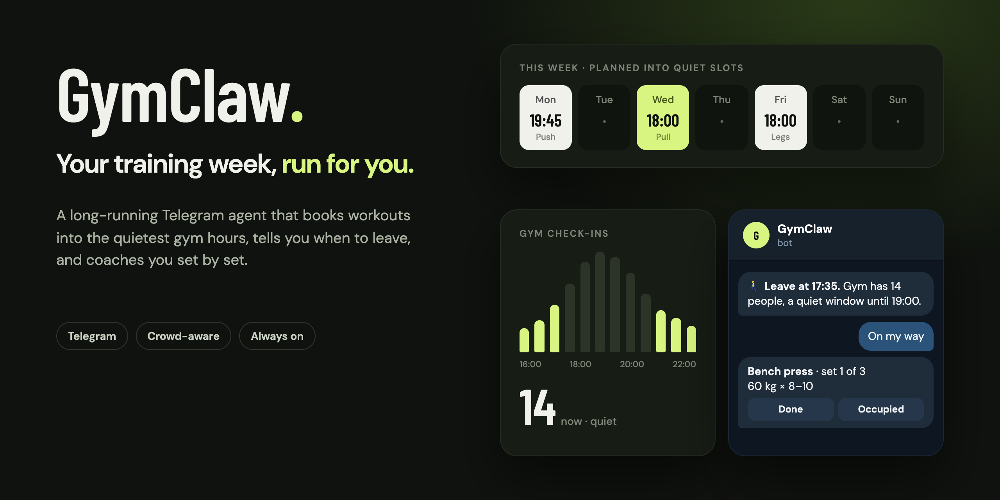
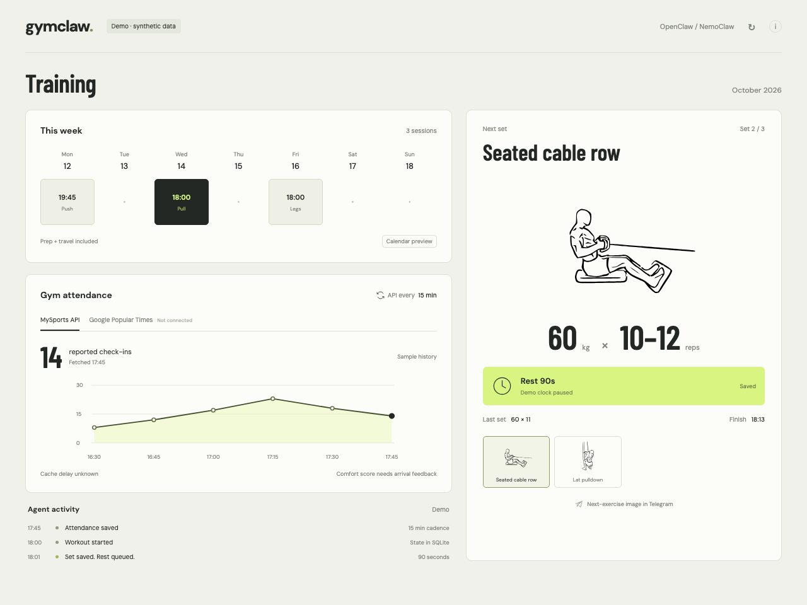

# GymClaw

A Telegram bot that plans my gym week around my calendar and coaches me through each workout.

> **Work in progress.** I use it every day, and it has rough edges. Expect breaking changes.

## What it does

- Plans the week into the quietest gym slots that fit my calendar and rest days, and replans when
  meetings, trips or sick days get in the way, or when I ask in chat.
- Reminds me when to get ready and when to leave, with the current crowd.
- Coaches the workout set by set: exercise picture, target, one-tap or typed sets (`10x80`), rest
  timer, swaps to a same-muscle exercise.
- Raises targets when I hit all my reps, and sends a weekly recap every Sunday.
- Tracks body weight from scale photos.

## How it works

One Rust binary over one SQLite file ([architecture](docs/architecture.md)). An LLM agent (via
OpenRouter) handles the conversation and the decisions, using typed tools that own all state and
validate every action. A model-free coach handles taps and sets during a workout, and an in-process
scheduler runs calendar sync, crowd polling, reminders and the Sunday plan.

## Running your own

You need a Telegram bot, an OpenRouter key, a Google calendar and, for crowd-aware planning, your
gym's check-in count ([crowd data](docs/crowd.md)). Then `docker compose up` and follow
[self-hosting](docs/self-hosting.md).

## License

[Business Source License 1.1](LICENSE): free to clone, self-host and modify for noncommercial use;
commercial use needs a license from the author. Each release becomes Apache 2.0 four years after
it is published. Exercise art from [Workout Guide](https://github.com/bryllim/workout-guide).
